<div align="center">

<a href="https://github.com/hariprakash0804">
  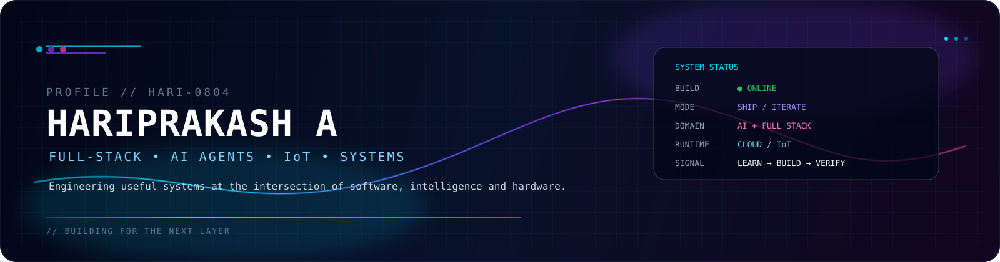
</a>

<br/>


<br/>

[](https://github.com/hariprakash0804)
[](https://github.com/hariprakash0804?tab=followers)
[](https://portfolio-eight-plum-38.vercel.app)
[](https://github.com/hariprakash0804)

</div>

<!-- ═══════════════════════════════════ NAVIGATION ═══════════════════════════════════ -->

<div align="center">

```
╔══════════════════════════════════════════════════════════════════════════════════╗
║  ◈ NAVIGATION MATRIX                                                          ║
╚══════════════════════════════════════════════════════════════════════════════════╝
```

[`01` IDENTITY](#-identity-matrix)　·　[`02` COMMAND CENTER](#-command-center)　·　[`03` CAPABILITIES](#-core-capabilities)　·　[`05` BUILDS](#-active-builds)　·　[`06` PROJECTS](#-featured-projects)

[`07` WINS](#-research--leadership--wins)　·　[`08` EDUCATION](#-education-timeline)　·　[`09` MISSION](#-mission-control--2026)　·　[`10` TELEMETRY](#-github-telemetry)　·　[`12` CONTRIBUTION](#-contribution-core)　·　[`14` CONNECT](#-connect)

</div>

<!-- ═══════════════════════════════════ DIVIDER ═══════════════════════════════════ -->

<div align="center">
  
</div>

<!-- ═══════════════════════════════════ IDENTITY ═══════════════════════════════════ -->

<div align="center">
  
</div>

<br/>

## ◈ Identity Matrix

<table>
<tr>
<td width="62%" valign="top">

### `WHO_AM_I`

> **Engineer. Builder. Experimenter.**

I build across **full-stack engineering, AI/ML, automation, IoT and embedded systems**, with a bias toward products that move from concept to something people can actually use.

The interesting work lives in the middle: architecture, APIs, data, automation, interfaces, hardware, observability and the tiny bugs humanity continues to describe as "edge cases."

```yaml
identity:
  name: Hariprakash A
  base: Salem, Tamil Nadu, India
  degree: B.Tech Information Technology

focus:
  - Full-Stack Engineering
  - AI Agents & RAG
  - Automation
  - IoT & Embedded Systems

current_builds:
  - Topic Intelligence Platform
  - AI Agent Verification Framework
```

</td>
<td width="38%" valign="top">

### `CURRENT_SIGNAL`

```text
┌─────────────────────────────┐
│  ◆ SYSTEM STATUS            │
│  ───────────────────────    │
│  SYSTEM       ● ONLINE      │
│  MODE         SHIP           │
│  DOMAIN       AI / FS        │
│  HARDWARE     IoT            │
│  CLOUD        ACTIVE         │
│  LEARNING     CONTINUOUS     │
│  UPTIME       99.9%          │
└─────────────────────────────┘
```

<div align="center">


</div>

</td>
</tr>
</table>

> **`// BUILD USEFUL THINGS. MAKE THEM RELIABLE. THEN MAKE THEM BEAUTIFUL.`**

<!-- ═══════════════════════════════════ DIVIDER ═══════════════════════════════════ -->

<div align="center">
  
</div>

<!-- ═══════════════════════════════════ COMMAND CENTER ═══════════════════════════════════ -->

<div align="center">
  
</div>

<br/>

## ◈ Command Center

<div align="center">
  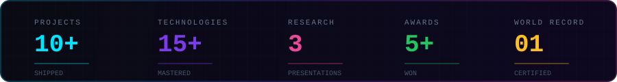
</div>

<br/>

<details>
<summary><b>▣ Expand mission profile</b></summary>

<br/>

| Signal | Current State |
|---|---|
| **Primary lane** | Full-Stack + AI Systems |
| **Secondary lane** | IoT + Embedded Engineering |
| **Build philosophy** | Useful → Reliable → Beautiful |
| **Favorite challenge** | Turning messy ideas into structured systems |
| **Operating loop** | Learn → Build → Measure → Verify → Ship |

</details>

<!-- ═══════════════════════════════════ DIVIDER ═══════════════════════════════════ -->

<div align="center">
  
</div>

<!-- ═══════════════════════════════════ CAPABILITIES ═══════════════════════════════════ -->

<div align="center">
  
</div>

<br/>

## ◈ Core Capabilities

<div align="center">
  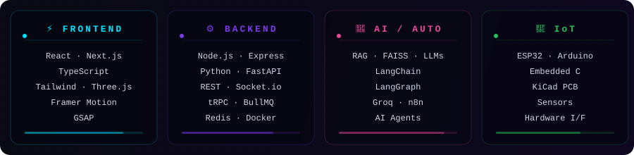
</div>

<!-- ═══════════════════════════════════ DIVIDER ═══════════════════════════════════ -->

<div align="center">
  
</div>

<!-- ═══════════════════════════════════ TECHNOLOGY MATRIX ═══════════════════════════════════ -->

<div align="center">

```
╔══════════════════════════════════════════════════════════════════════════════════╗
║  ◉ 04 — TECHNOLOGY MATRIX                                        ◆ EXPANDED  ║
╚══════════════════════════════════════════════════════════════════════════════════╝
```

</div>

<details>
<summary><b>🧬 Expand the full stack</b></summary>

<br/>

### `LANGUAGES`

<div align="center">
<a href="https://skillicons.dev">

</a>
</div>

### `FRONTEND / MOBILE`

<div align="center">
<a href="https://skillicons.dev">

</a>
<br/><br/>


</div>

### `BACKEND / DATABASE / INFRA`

<div align="center">
<a href="https://skillicons.dev">

</a>
<br/><br/>


</div>

### `AI / ML / AUTOMATION`

<div align="center">


</div>

### `IoT / EMBEDDED`

<div align="center">


</div>

### `TOOLS / DELIVERY`

<div align="center">
<a href="https://skillicons.dev">

</a>
</div>

</details>

<!-- ═══════════════════════════════════ DIVIDER ═══════════════════════════════════ -->

<div align="center">
  
</div>

<!-- ═══════════════════════════════════ ACTIVE BUILDS ═══════════════════════════════════ -->

<div align="center">
  
</div>

<br/>

## ◈ Active Builds

<table>
<tr>
<td width="50%" valign="top">

### 🛰️ Topic Intelligence Platform

**Signal in → intelligence out**

```text
┌─────────────────────────────┐
│  RSS / News APIs            │
│        ↓                    │
│  Deduplication              │
│        ↓                    │
│  LLM Summarization         │
│        ↓                    │
│  Slack + Email              │
│                             │
│  STATUS: ● ACTIVE           │
└─────────────────────────────┘
```

Multi-source intelligence pipeline built around **n8n, Groq and structured automation**.


</td>
<td width="50%" valign="top">

### 🧪 AI Agent Verification Framework

**Trust, but verify the robot.**

```text
┌─────────────────────────────┐
│  AI Agent                   │
│     ↓                       │
│  Real file changes          │
│     ↓                       │
│  Diff capture               │
│     ↓                       │
│  Claim vs. reality          │
│     ↓                       │
│  Verification               │
│                             │
│  STATUS: ● IN DEVELOPMENT   │
└─────────────────────────────┘
```

Tooling concept for detecting **phantom edits, misleading test claims and other agent-side optimism**.


</td>
</tr>
</table>

<!-- ═══════════════════════════════════ DIVIDER ═══════════════════════════════════ -->

<div align="center">
  
</div>

<!-- ═══════════════════════════════════ FEATURED PROJECTS ═══════════════════════════════════ -->

<div align="center">

```
╔══════════════════════════════════════════════════════════════════════════════════╗
║  ◉ 06 — FEATURED PROJECTS                              ◆ SELECTED SIGNAL     ║
╚══════════════════════════════════════════════════════════════════════════════════╝
```

</div>

## ◈ Featured Projects

> **`// SELECTED SIGNAL, NOT THE ENTIRE WAREHOUSE.`**

<table>
<tr>
<td width="50%" valign="top">

### ⚖️ [LegalBuddy AI](https://legalbuddy-frontend-eta.vercel.app)

Multilingual legal-aid conversational platform using **RAG-based retrieval**, dense vector search and context-aware guidance grounded in Indian legal material.


[](https://legalbuddy-frontend-eta.vercel.app)
[](https://github.com/hariprakash0804/legalbuddy-frontend)

</td>
<td width="50%" valign="top">

### 🍴 [Digital Canteen](https://github.com/hariprakash0804/Digital-Canteen)

Campus food-ordering system with **student, shop-owner and admin consoles**, digital-coin wallet and vendor inventory management.


[](https://github.com/hariprakash0804/Digital-Canteen)

</td>
</tr>
<tr>
<td width="50%" valign="top">

### 💞 [Heaven Match](https://github.com/hariprakash0804/Heaven-Match)

Full-stack matchmaking platform with responsive UI, authentication and profile management.


[](https://github.com/hariprakash0804/Heaven-Match)

</td>
<td width="50%" valign="top">

### 🎮 [Tic-Tac-Toe](https://github.com/hariprakash0804/tictactoe)

Browser game focused on clean JavaScript, DOM manipulation, state management and responsive UI.


[](https://github.com/hariprakash0804/tictactoe)

</td>
</tr>
</table>

<!-- ═══════════════════════════════════ DIVIDER ═══════════════════════════════════ -->

<div align="center">
  
</div>

<!-- ═══════════════════════════════════ WINS ═══════════════════════════════════ -->

<div align="center">
  
</div>

<br/>

## ◈ Research · Leadership · Wins

<div align="center">

<table>
<tr>
<td align="center" width="25%">

### 🌍
**WORLD RECORD**

```text
┌──────────────────┐
│ Asian Book of    │
│ World Records    │
│                  │
│ TanMillets       │
│ Awareness        │
│ Initiative       │
│                  │
│ STATUS: VERIFIED │
└──────────────────┘
```

</td>
<td align="center" width="25%">

### 🏅
**TEAM LEAD**

```text
┌──────────────────┐
│ Smart India      │
│ Hackathon        │
│                  │
│ AI-Powered       │
│ Agriculture      │
│ Solution         │
│                  │
│ STATUS: SHIPPED  │
└──────────────────┘
```

</td>
<td align="center" width="25%">

### 📄
**3× RESEARCH**

```text
┌──────────────────┐
│ Presented at:    │
│                  │
│ ◈ Kalasalingam   │
│ ◈ KIT            │
│ ◈ KSR            │
│                  │
│ STATUS: ACCEPTED │
└──────────────────┘
```

</td>
<td align="center" width="25%">

### 🗣️
**PRESIDENT**

```text
┌──────────────────┐
│ Kamban Tamil     │
│ Mandram          │
│                  │
│ Culture &        │
│ Literature       │
│ Initiatives      │
│                  │
│ STATUS: ACTIVE   │
└──────────────────┘
```

</td>
</tr>
</table>

</div>

<!-- ═══════════════════════════════════ DIVIDER ═══════════════════════════════════ -->

<div align="center">
  
</div>

<!-- ═══════════════════════════════════ EDUCATION ═══════════════════════════════════ -->

<div align="center">
  
</div>

<br/>

## ◈ Education Timeline

<div align="center">
  
</div>

<!-- ═══════════════════════════════════ DIVIDER ═══════════════════════════════════ -->

<div align="center">
  
</div>

<!-- ═══════════════════════════════════ MISSION CONTROL ═══════════════════════════════════ -->

<div align="center">
  
</div>

<br/>

## ◈ Mission Control — 2026

<div align="center">
  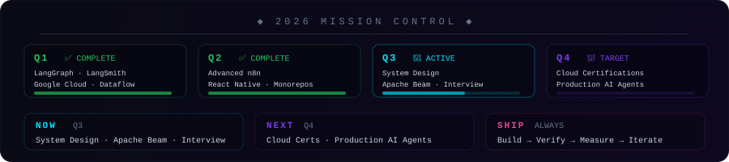
</div>

<!-- ═══════════════════════════════════ DIVIDER ═══════════════════════════════════ -->

<div align="center">
  
</div>

<!-- ═══════════════════════════════════ TELEMETRY ═══════════════════════════════════ -->

<div align="center">
  
</div>

<br/>

## ◈ GitHub Telemetry

<div align="center">


<br/>


<a href="https://github.com/hariprakash0804">
  
</a>

</div>

<!-- ═══════════════════════════════════ DIVIDER ═══════════════════════════════════ -->

<div align="center">
  
</div>

<!-- ═══════════════════════════════════ RECENT ACTIVITY ═══════════════════════════════════ -->

<div align="center">

```
╔══════════════════════════════════════════════════════════════════════════════════╗
║  ◉ 11 — RECENT ACTIVITY STREAM                               ◆ AUTO-SYNCED   ║
╚══════════════════════════════════════════════════════════════════════════════════╝
```

</div>

<!--RECENT_ACTIVITY:start-->
<!-- This section is updated automatically by .github/workflows/recent-activity.yml -->
<!--RECENT_ACTIVITY:end-->

<!-- ═══════════════════════════════════ DIVIDER ═══════════════════════════════════ -->

<div align="center">
  
</div>

<!-- ═══════════════════════════════════ CONTRIBUTION CORE ═══════════════════════════════════ -->

<div align="center">
  
</div>

<br/>

## ◈ Contribution Core

<div align="center">

```text
╔══════════════════════════════════════════════════════════════════╗
║  CONTRIBUTION CORE                                             ║
║  ─────────────────────────────────────────────────────────────  ║
║  [ LIVE ACTIVITY MATRIX ]        [ SNAKE ENGINE : ONLINE ]     ║
╚══════════════════════════════════════════════════════════════════╝
```

<p>
  
  
  
</p>

<picture>
  <source media="(prefers-color-scheme: dark)" srcset="https://raw.githubusercontent.com/hariprakash0804/hariprakash0804/output/github-snake-dark.svg" />
  <source media="(prefers-color-scheme: light)" srcset="https://raw.githubusercontent.com/hariprakash0804/hariprakash0804/output/github-snake.svg" />
  
</picture>

<br/>

<table>
<tr>
<td align="center" width="33%">

**◈ FEED**

```text
Commit history
```

</td>
<td align="center" width="33%">

**◈ VECTOR**

```text
Contribution path
```

</td>
<td align="center" width="33%">

**◈ SIGNAL**

```text
Activity intensity
```

</td>
</tr>
</table>

<sub>Generated automatically from GitHub contribution data via Platane/snk.</sub>

</div>

<!-- ═══════════════════════════════════ DIVIDER ═══════════════════════════════════ -->

<div align="center">
  
</div>

<!-- ═══════════════════════════════════ PROOF OF WORK ═══════════════════════════════════ -->

<div align="center">

```
╔══════════════════════════════════════════════════════════════════════════════════╗
║  ◉ 13 — PROOF OF WORK                                        ◆ VERIFIED      ║
╚══════════════════════════════════════════════════════════════════════════════════╝
```

<br/>


**`// SELECTED REPOS FIRST. DYNAMIC TELEMETRY SECOND. EVERYTHING ELSE LIVES IN THE CODE.`**

</div>

<!-- ═══════════════════════════════════ DIVIDER ═══════════════════════════════════ -->

<div align="center">
  
</div>

<!-- ═══════════════════════════════════ CONNECT ═══════════════════════════════════ -->

<div align="center">
  
</div>

<br/>

## ◈ Connect

<div align="center">

[](https://www.linkedin.com/in/hariprakash-a-55bab6261)
[](https://portfolio-eight-plum-38.vercel.app)
[](mailto:hariprakashanbarasan@gmail.com)
[](https://github.com/hariprakash0804)
[](https://drive.google.com/file/d/1T09Hg_cIUDFJqzd46WeuK-X46eoSoJVL/view?usp=sharing)

<br/>

```text
╔══════════════════════════════════════════════════════════════════╗
║  ◆ CONTACT MATRIX                                              ║
║  ─────────────────────────────────────────────────────────────  ║
║  EMAIL      hariprakashanbarasan@gmail.com                      ║
║  LOCATION   Salem, Tamil Nadu, India                            ║
║  LANGUAGES  Tamil · English · Kannada                           ║
║  INTO       Books · Music · Technology                          ║
║  STATUS     ● OPEN TO OPPORTUNITIES                             ║
╚══════════════════════════════════════════════════════════════════╝
```

</div>

<!-- ═══════════════════════════════════ DIVIDER ═══════════════════════════════════ -->

<div align="center">
  
</div>

<!-- ═══════════════════════════════════ FOOTER ═══════════════════════════════════ -->

<div align="center">

### `> SYSTEM MESSAGE`


<br/><br/>


</div>
